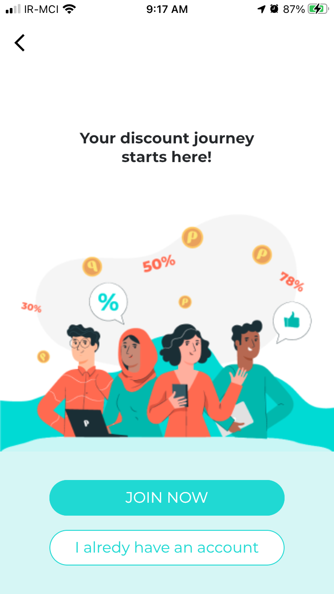

# papasi

I've been starting for 9 months. This is a concept for loyalty club that users can interact with micro businesses and gain coin duo to buying something.
I used graphQL and Flutter.

# Screenshots

  
   
  

